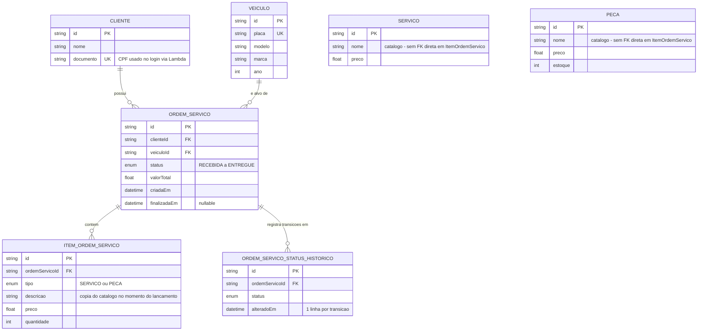

# Modelo de Dados — Justificativa e ERD

## Por que PostgreSQL

O dominio da oficina (clientes, veiculos, ordens de servico, itens de
servico/peca, historico de status) e fortemente relacional: toda consulta
relevante do negocio (SLA de atendimento, ordens por status, historico de
transicoes) depende de `JOIN`s entre entidades com integridade referencial
garantida pelo banco. PostgreSQL foi escolhido (ver
[RFC-002](rfc/RFC-002-postgresql-rds.md) e
[ADR-011](adr/ADR-011-Transição-PostgreSQL-Prisma-ORM.md)) por:

- Suporte nativo a chaves estrangeiras, enums e indices — usados
  diretamente no schema (`StatusOrdemServico`, `TipoItem`, `@@index`).
- Maturidade do driver (`pg`) e do adapter usado (`@prisma/adapter-pg`),
  ja validados desde a Fase 2.
- Disponibilidade como serviço gerenciado (RDS) com o mesmo engine, sem
  exigir migração de schema/queries entre fases.

## Diagrama ERD

## Relacionamentos

| Relacionamento | Cardinalidade | Observação |
|---|---|---|
| `Cliente` → `OrdemServico` | 1:N | Um cliente pode ter várias ordens de serviço ao longo do tempo. |
| `Veiculo` → `OrdemServico` | 1:N | Um veículo pode passar por várias ordens de serviço (revisões distintas). |
| `OrdemServico` → `ItemOrdemServico` | 1:N | Itens (peças/serviços) lançados na OS, com `onDelete: Cascade`. |
| `OrdemServico` → `OrdemServicoStatusHistorico` | 1:N | Uma linha por transição de status, com `onDelete: Cascade`. |

`Servico` e `Peca` funcionam como **catálogo** — `ItemOrdemServico` não tem
chave estrangeira para eles, e sim copia `descricao`/`preco` no momento do
lançamento. Essa é uma decisão deliberada (herdada da Fase 2): o preço de
um item já lançado numa OS não deve mudar retroativamente se o preço do
catálogo for atualizado depois.

## Por que a tabela `OrdemServicoStatusHistorico` (Fase 3)

O schema original (Fase 2) só tinha dois timestamps na OS: `criadaEm` e
`finalizadaEm` — suficientes para medir o tempo **total** de atendimento
(usado no endpoint `GET /os/sla-atendimento`, já existente desde a Fase 2),
mas **insuficientes** para medir quanto tempo uma OS passou em cada status
individual (`EM_DIAGNOSTICO`, `AGUARDANDO_APROVACAO`, `EM_EXECUCAO`, etc.) —
métrica explicitamente exigida pelo dashboard de observabilidade da Fase 3
("tempo médio de execução por status").

A tabela `ordens_servico_status_historico` resolve isso registrando **uma
linha por transição de status**, com o timestamp exato da mudança
(`alteradoEm`). A duração de cada status é calculada subtraindo o
`alteradoEm` de uma linha do `alteradoEm` da linha anterior para a mesma
OS — feito em runtime pelo `PrismaHistoricoStatusRepository`, que observa a
duração diretamente no histograma Prometheus
`oficina_ordem_servico_status_duration_seconds` a cada nova transição (ver
[ADR-015](adr/ADR-015-observabilidade-json-logs-metricas.md)).

**Limitação conhecida**: OS criadas antes desta migration (`20260915000000_ordem_servico_status_historico`)
não têm histórico de transições anteriores — receberam, no backfill da
migration, um único evento com o status atual e `alteradoEm = criadaEm`. A
métrica de duração por status só é precisa para transições ocorridas
**depois** do deploy desta mudança.

## Referências

- Schema completo: [`oficina-app/prisma/schema.prisma`](../prisma/schema.prisma)
- Migration da tabela de histórico: [`prisma/migrations/20260915000000_ordem_servico_status_historico/`](../prisma/migrations/20260915000000_ordem_servico_status_historico/migration.sql)
- [RFC-002 — Escolha do PostgreSQL/RDS](rfc/RFC-002-postgresql-rds.md)
- [ADR-011 — Transição PostgreSQL/Prisma ORM](adr/ADR-011-Transição-PostgreSQL-Prisma-ORM.md)
- [ADR-015 — Observabilidade](adr/ADR-015-observabilidade-json-logs-metricas.md)
